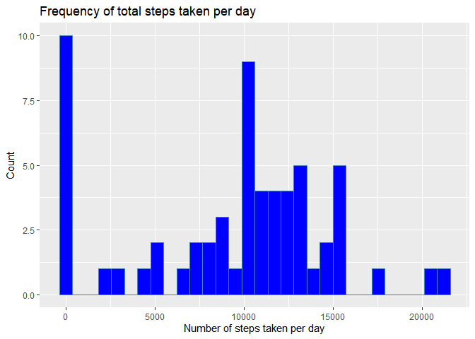
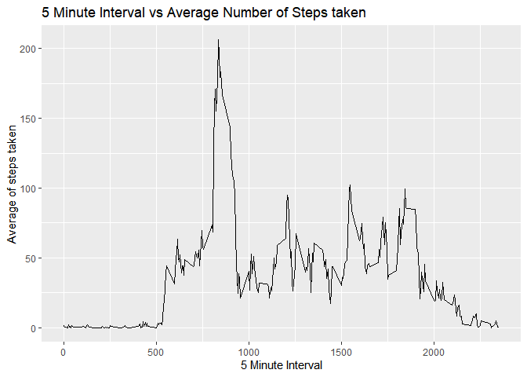
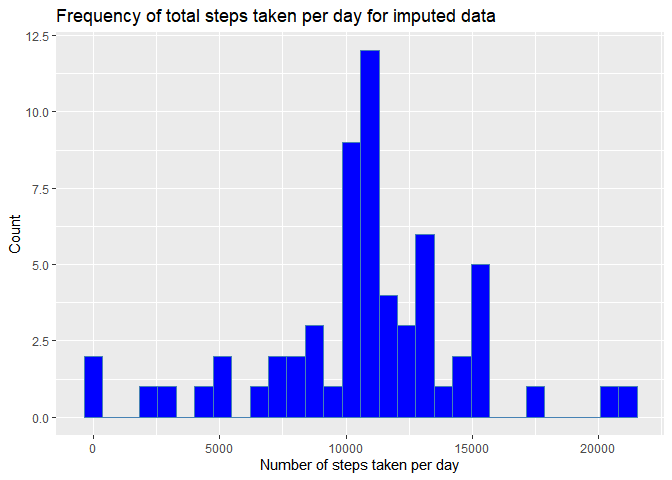
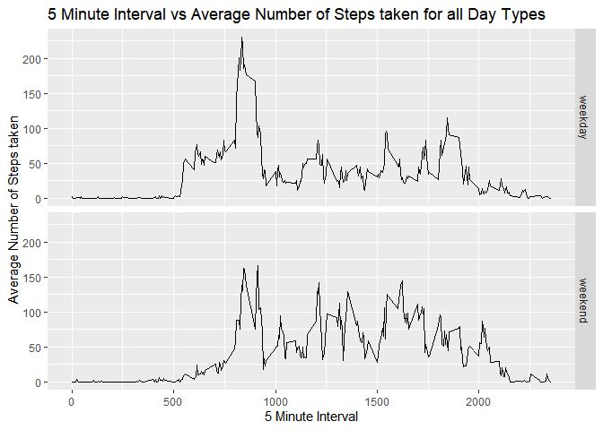

### Clearing environment vairables and setting up required libraries:  


```r
rm(list=ls())
library(dplyr)
```

```
## 
## Attaching package: 'dplyr'
```

```
## The following objects are masked from 'package:stats':
## 
##     filter, lag
```

```
## The following objects are masked from 'package:base':
## 
##     intersect, setdiff, setequal, union
```

```r
library(ggplot2)
```


## Loading and preprocessing the data

### Loading the file using read.csv() function.


```r
activityData <- read.csv(unz("activity.zip", "activity.csv"), header=T)

head(activityData)
```

```
##   steps       date interval
## 1    NA 2012-10-01        0
## 2    NA 2012-10-01        5
## 3    NA 2012-10-01       10
## 4    NA 2012-10-01       15
## 5    NA 2012-10-01       20
## 6    NA 2012-10-01       25
```

### Pre-processing the data

Performing the following steps:    
 1. Converting the date from string to Date datatype  
 2. Using the interval value to derive the time value


```r
activityData <- activityData %>% as_tibble %>%mutate(date = as.Date(x =
                as.character(date), "%Y-%m-%d"), time = interval / 100.00)

head(activityData)
```

```
## # A tibble: 6 x 4
##   steps date       interval  time
##   <int> <date>        <int> <dbl>
## 1    NA 2012-10-01        0  0   
## 2    NA 2012-10-01        5  0.05
## 3    NA 2012-10-01       10  0.1 
## 4    NA 2012-10-01       15  0.15
## 5    NA 2012-10-01       20  0.2 
## 6    NA 2012-10-01       25  0.25
```
## What is mean total number of steps taken per day?

### Total Number of steps taken per day:


```r
total_steps <- activityData %>% group_by(date) %>% summarise(sum_steps = 
                sum(steps, na.rm = TRUE)) 

head(total_steps)
```

```
## # A tibble: 6 x 2
##   date       sum_steps
##   <date>         <int>
## 1 2012-10-01         0
## 2 2012-10-02       126
## 3 2012-10-03     11352
## 4 2012-10-04     12116
## 5 2012-10-05     13294
## 6 2012-10-06     15420
```

### Histogram of total steps taken per day  


```r
ggplot(total_steps, aes(x = sum_steps)) + geom_histogram(bins = 30, color = "steelblue", fill = "blue")  + 
        labs(title = "Frequency of total steps taken per day", x = "Number of steps taken per day", y = "Count")
```

<!-- -->

### Mean and median of total number of steps taken per day:


```r
mean_total_steps <- mean(total_steps$sum_steps, na.rm = TRUE)

median_total_steps <- median(total_steps$sum_steps, na.rm = TRUE)
```

The **mean** of the total number of steps taken per day is 
**9354.2295082**

The **median** of the total number of steps taken per day is **10395**
  

## What is the average daily activity pattern?

### A time series plot of 5-minute interval vs the average number of steps taken, averaged across all days


```r
average_steps <- activityData %>% group_by(interval) %>% summarise(mean_steps = 
                mean(steps, na.rm = TRUE)) 

qplot(x = interval, y = mean_steps, data = average_steps, geom = "line" , xlab = "5 Minute Interval", ylab = "Average of steps taken", main = "5 Minute Interval vs Average Number of Steps taken")
```

<!-- -->

### 5-minute interval which has the maximum number of steps across all days:


```r
max_interval_average <- average_steps[which.max(average_steps$mean_steps),c(1)]
```

The 5-minute interval, on average across all the days in the dataset, contains the **maximum** number of steps is: **835**  

## Imputing missing values

###Total number of missing values in the dataset


```r
total_NA <- (activityData %>% filter(is.na(steps)) %>% tally())
```

**Total number of missing values** in the dataset i.e. the total number of NA values are **2304**

### Strategy to fill the missing values in the datasets: 

Mean values for the 5 minute interval across all days, i.e. if a value is missing the 5 minute interval across all days will be inserted for the corersponding interval.

### Final dataset with the imputed values:

```r
finalData <- activityData

finalData <- merge(finalData, average_steps, on = "interval")
finalData <- finalData %>% mutate(steps = ifelse(is.na(steps),mean_steps,steps)) %>% 
        select(steps, date, interval, time) %>% arrange(date, interval)

head(finalData)
```

```
##       steps       date interval time
## 1 1.7169811 2012-10-01        0 0.00
## 2 0.3396226 2012-10-01        5 0.05
## 3 0.1320755 2012-10-01       10 0.10
## 4 0.1509434 2012-10-01       15 0.15
## 5 0.0754717 2012-10-01       20 0.20
## 6 2.0943396 2012-10-01       25 0.25
```

### Histogram of steps taken per day, mean and median of total steps taken per day and comparision with the original data.


```r
total_steps_final <- finalData %>% group_by(date) %>% summarise(sum_steps = 
                sum(steps, na.rm = TRUE)) 

ggplot(total_steps_final, aes(x = sum_steps)) + geom_histogram(bins = 30, color = "steelblue", fill = "blue")  + 
        labs(title = "Frequency of total steps taken per day for imputed data", x = "Number of steps taken per day", y = "Count")
```

<!-- -->

```r
mean_total_steps_final <- as.character(as.numeric(mean(total_steps_final$sum_steps, na.rm = TRUE)))

median_total_steps_final <- as.character(as.numeric(median(total_steps_final$sum_steps, na.rm = TRUE)))
```

The **mean** of the total number of steps taken per day is 
**10766.1886792453**

The **median** of the total number of steps taken per day is **10766.1886792453**

**Difference in mean** after updating the NA's and before updating the NA's is: **1411.959171**

**Difference in median** after updating the NA's and before updating the NA's is: **371.1886792**
  
The impact of imputing the data is that there are lesser NA values which also being the mean and the median values closer to each other.


## Are there differences in activity patterns between weekdays and weekends?

### Adding new factor variable which differentiates between weekday and weekend


```r
dayType <- function(date){
        dayOfWeek <- weekdays(date)
        if (dayOfWeek == "Saturday" || dayOfWeek == "Sunday"){ return("weekend")}
        else { return("weekday")}
}
finalData <- finalData %>% mutate(daytype = as.factor(sapply(date,dayType)) )

head(finalData)
```

```
##       steps       date interval time daytype
## 1 1.7169811 2012-10-01        0 0.00 weekday
## 2 0.3396226 2012-10-01        5 0.05 weekday
## 3 0.1320755 2012-10-01       10 0.10 weekday
## 4 0.1509434 2012-10-01       15 0.15 weekday
## 5 0.0754717 2012-10-01       20 0.20 weekday
## 6 2.0943396 2012-10-01       25 0.25 weekday
```

### A panel plot containing a time series plot of the 5-minute interval vs the average number of steps taken, averaged across all weekday days or weekend days


```r
average_steps_final <- finalData %>% group_by(interval, daytype) %>% summarise(mean_steps = 
                mean(steps, na.rm = TRUE)) 

qplot(x = interval, y = mean_steps, data = average_steps_final, geom = "line", facets = daytype ~ ., main = "5 Minute Interval vs Average Number of Steps taken for all Day Types", xlab =  "5 Minute Interval", ylab = "Average Number of Steps taken")
```

<!-- -->
